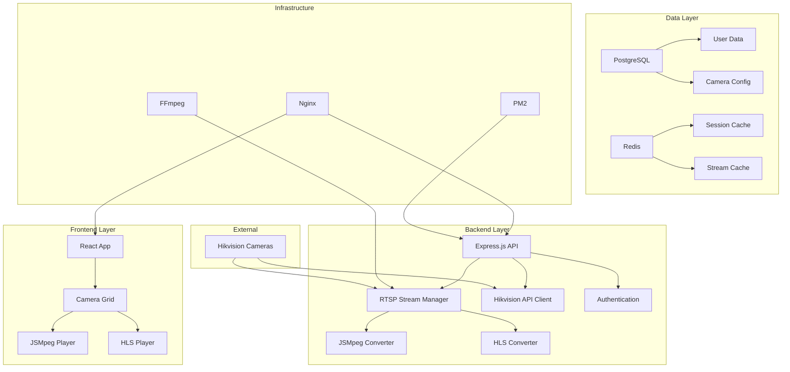

# 🎥 JERICHO Security Type-C


**Complete surveillance security system with proven RTSP streaming, Hikvision integration, and real-time monitoring capabilities.**

## 🚀 **ONE-LINE INSTALLATION**

Install the complete JERICHO Security system on fresh Ubuntu 24.04 with a single command:

```bash
curl -fsSL https://raw.githubusercontent.com/AbdurahmanZA/jericho-security-type-c/main/install.sh | bash
```

**That's it!** The installer will automatically:
- ✅ Install all dependencies (Node.js, PostgreSQL, Redis, FFmpeg, Nginx)
- ✅ Setup the complete RTSP streaming solution
- ✅ Configure the database and environment
- ✅ Build and deploy frontend and backend
- ✅ Configure firewall and security settings
- ✅ Start all services with PM2

---

## 🎯 **What You Get**

### **🎥 Proven RTSP Streaming Solution**
- **Dual streaming approach**: JSMpeg (low latency) + HLS (universal compatibility)
- **Battle-tested**: Based on most popular GitHub RTSP projects
- **Auto-recovery**: Streams restart automatically on failures
- **Multi-camera support**: Handle 12+ concurrent streams
- **Works where WebRTC fails**: Universal browser compatibility

### **🔧 Hikvision API Integration**
- **ISAPI support** with AK/SK authentication
- **Automatic camera discovery** 
- **Real-time camera management**
- **Motion detection and alerts**

### **🌐 Full-Stack Web Application**
- **React frontend** with modern responsive design
- **Express.js backend** with RESTful API
- **PostgreSQL database** for data persistence
- **Redis caching** for performance
- **JWT authentication** system

### **📊 Production-Ready Features**
- **Process management** with PM2
- **Nginx reverse proxy** configuration
- **SSL/HTTPS ready** 
- **Firewall configuration**
- **Automated backups**
- **Health monitoring**

---

## 📋 **System Requirements**

- **OS**: Ubuntu 24.04 LTS (Fresh installation recommended)
- **RAM**: Minimum 4GB, Recommended 8GB+
- **Disk**: Minimum 20GB free space
- **Network**: Stable internet connection
- **Privileges**: User with sudo access

---

## 🔧 **Quick Start Guide**

### **1. Installation**
```bash
# One-line installation
curl -fsSL https://raw.githubusercontent.com/AbdurahmanZA/jericho-security-type-c/main/install.sh | bash
```

### **2. First Access**
```bash
# Open your browser to:
http://YOUR-SERVER-IP

# Default credentials:
Username: admin
Password: admin123!
```

### **3. Basic Configuration**
1. **Change default password** immediately
2. **Add Hikvision credentials** in Settings → Camera Integration
3. **Discover cameras** using the Camera Discovery feature
4. **Start streaming** and enjoy real-time monitoring

---

## 🎥 **RTSP Streaming Features**

### **JSMpeg Streaming (Low Latency)**
- **Protocol**: WebSocket over TCP
- **Latency**: < 500ms
- **Best for**: Real-time monitoring, security applications
- **Browser support**: Chrome, Firefox, Safari, Edge

### **HLS Streaming (Universal)**
- **Protocol**: HTTP Live Streaming
- **Latency**: 2-6 seconds
- **Best for**: Recording, playback, mobile devices
- **Browser support**: All modern browsers, mobile apps

### **Stream Management**
```bash
# Check stream status
curl http://localhost:8080/api/streams

# Example response:
{
  "camera-1": {
    "jsmpeg": {"wsUrl": "ws://localhost:9999", "isRunning": true},
    "hls": {"playlistUrl": "/hls/camera-1/camera-1.m3u8", "isRunning": true}
  }
}
```

---

## 🔌 **API Endpoints**

### **Authentication**
```bash
POST /api/auth/login          # User login
POST /api/auth/refresh        # Refresh JWT token
POST /api/auth/logout         # User logout
```

### **Camera Management**
```bash
GET  /api/cameras             # List all cameras
POST /api/cameras/discover    # Discover Hikvision cameras
POST /api/cameras/:id/stream  # Start camera stream
DELETE /api/cameras/:id/stream # Stop camera stream
```

### **Streaming**
```bash
GET  /api/streams             # List all active streams
GET  /api/streams/:id         # Get specific stream info
GET  /hls/:id/:id.m3u8       # HLS playlist
WS   ws://localhost:999X      # JSMpeg WebSocket streams
```

### **System**
```bash
GET  /api/health              # System health check
GET  /api/status              # Detailed system status
```

---

## 🛠️ **Management Commands**

### **System Status**
```bash
# Check overall system status
jericho-status

# Check PM2 processes
pm2 status

# View application logs
pm2 logs jericho-backend

# Restart services
pm2 restart jericho-backend
```

### **Service Management**
```bash
# Start/stop/restart individual services
sudo systemctl start postgresql
sudo systemctl start redis-server
sudo systemctl start nginx

# Check service status
sudo systemctl status postgresql redis-server nginx
```

### **Database Operations**
```bash
# Connect to database
psql -h localhost -U jericho -d jericho_security

# Check Redis
redis-cli ping
```

---

## 🔧 **Configuration**

### **Environment Variables**
Located in `/opt/jericho-security/backend/.env`:

```bash
# Server Configuration
NODE_ENV=production
PORT=5000

# Database
DB_HOST=localhost
DB_PORT=5432
DB_NAME=jericho_security
DB_USER=jericho
DB_PASSWORD=jericho_secure_2024

# Hikvision API (ADD YOUR CREDENTIALS!)
HIKVISION_ACCESS_KEY=your_access_key_here
HIKVISION_SECRET_KEY=your_secret_key_here

# RTSP Streaming
RTSP_HTTP_PORT=8080
RTSP_WS_BASE_PORT=9999
FFMPEG_PATH=ffmpeg
```

### **Nginx Configuration**
Located in `/etc/nginx/sites-available/jericho` - automatically configured by installer.

---

## 📦 **Architecture Overview**



---

## 🚨 **Security Considerations**

### **Default Security Measures**
- ✅ JWT-based authentication
- ✅ Password hashing with bcrypt
- ✅ Rate limiting on API endpoints
- ✅ CORS protection
- ✅ SQL injection prevention
- ✅ XSS protection headers

### **Post-Installation Security**
1. **Change default credentials** immediately
2. **Enable SSL/HTTPS** for production
3. **Configure firewall rules** for your network
4. **Set up regular backups**
5. **Update system packages** regularly
6. **Monitor access logs**

---

## 📊 **Performance & Scaling**

### **Single Server Capacity**
- **Concurrent streams**: 12-20 (depending on hardware)
- **Concurrent users**: 100+ (web interface)
- **Storage**: Automatic cleanup of old segments
- **Memory usage**: ~2GB for 12 streams

### **Optimization Tips**
```bash
# Increase file descriptor limits
echo "* soft nofile 65536" | sudo tee -a /etc/security/limits.conf
echo "* hard nofile 65536" | sudo tee -a /etc/security/limits.conf

# Optimize FFmpeg for your hardware
# Edit backend/.env:
FFMPEG_THREADS=4
FFMPEG_PRESET=ultrafast
```

---

## 🐛 **Troubleshooting**

### **Common Issues**

**Q: Streams not starting?**
```bash
# Check FFmpeg installation
ffmpeg -version

# Check stream logs
pm2 logs jericho-backend | grep -i ffmpeg

# Test with public RTSP stream
curl -X POST http://localhost:5000/api/cameras/test/stream \
  -H "Content-Type: application/json" \
  -d '{"rtspUrl": "rtsp://wowzaec2demo.streamlock.net/vod/mp4:BigBuckBunny_115k.mov"}'
```

**Q: WebSocket connection failed?**
```bash
# Check firewall
sudo ufw status

# Check if ports are open
netstat -tlnp | grep -E '(9999|8080|5000)'

# Test WebSocket connection
wscat -c ws://localhost:9999
```

**Q: Camera discovery not working?**
- Verify Hikvision AK/SK credentials in `.env`
- Check network connectivity to cameras
- Ensure cameras are configured for ISAPI

### **Log Locations**
```bash
# Application logs
/opt/jericho-security/backend/logs/

# System logs
sudo journalctl -u nginx
sudo journalctl -u postgresql
sudo journalctl -u redis-server

# PM2 logs
pm2 logs jericho-backend
```

---

## 🔄 **Updates & Maintenance**

### **Updating the Application**
```bash
# Pull latest changes
cd /opt/jericho-security
git pull origin main

# Update dependencies
cd backend && npm install --production
cd ../frontend && npm install && npm run build

# Restart services
pm2 restart jericho-backend
```

### **Backup & Restore**
```bash
# Backup database
pg_dump -h localhost -U jericho jericho_security > backup_$(date +%Y%m%d).sql

# Backup configuration
tar -czf config_backup_$(date +%Y%m%d).tar.gz /opt/jericho-security/backend/.env
```

---

## 🤝 **Contributing**

We welcome contributions! Please:

1. Fork the repository
2. Create a feature branch: `git checkout -b feature/amazing-feature`
3. Commit changes: `git commit -m 'Add amazing feature'`
4. Push to branch: `git push origin feature/amazing-feature`
5. Open a Pull Request

---

## 📝 **License**

This project is licensed under the MIT License - see the [LICENSE](LICENSE) file for details.

---

## 🆘 **Support**

- **Issues**: [GitHub Issues](https://github.com/AbdurahmanZA/jericho-security-type-c/issues)
- **Discussions**: [GitHub Discussions](https://github.com/AbdurahmanZA/jericho-security-type-c/discussions)
- **Documentation**: [Wiki](https://github.com/AbdurahmanZA/jericho-security-type-c/wiki)

---

## 🌟 **Star History**

If you find this project useful, please consider giving it a star! ⭐

---

**Built with ❤️ by the JERICHO Security Team**